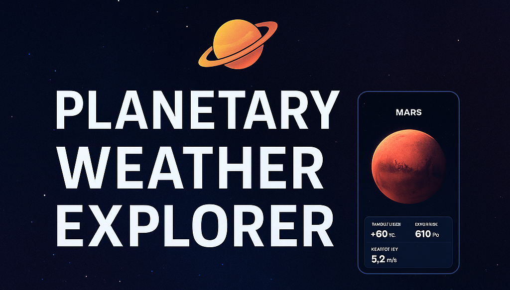
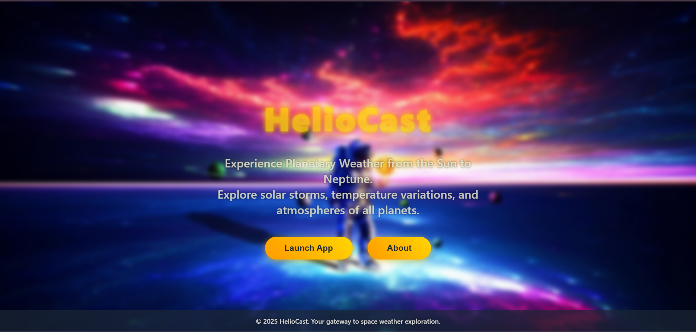
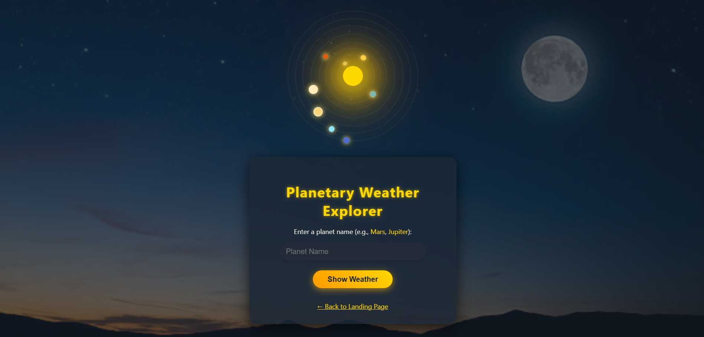
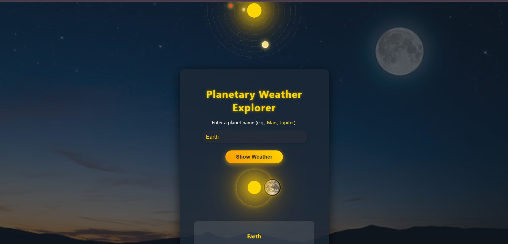
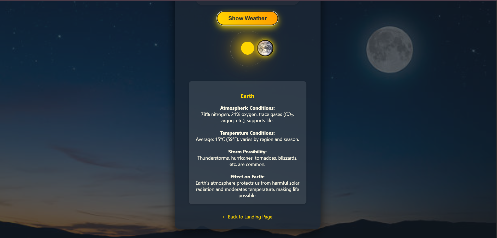

# 🌌 𝙋𝙡𝙖𝙣𝙚𝙩𝙖𝙧𝙮 𝙒𝙚𝙖𝙩𝙝𝙚𝙧 𝙀𝙭𝙥𝙡𝙤𝙧𝙚𝙧

✨ *Experience the Weather Beyond Earth* ✨
> ---
> 
> ---

---

## 🪐 What is This?

**Planetary Weather Explorer** is a lightweight, interactive web application designed to simulate and display planetary weather conditions across the solar system. It brings real or mock atmospheric data to your fingertips — all wrapped in a stunning space-themed UI.

---

## 💡 Key Features

🚀 Simulated or real-time planetary weather data
🪐 Choose between planets/moons like Mars, Venus, etc.
🌡️ Displays temperature, pressure, wind speed
🛰️ NASA API 
🎨 Responsive design with space-themed animations

---

## ⚙️ Tech Stack

- HTML5  
- CSS3 (Flexbox + Grid + Animations)  
- JavaScript (ES6 Vanilla)  
- NASA Open APIs / Mock JSON   

---

## 📸 Screenshots

> All image assets are inside the `/output/` folder.

### 🏠 Home Page  

### ☁️ Planet Weather Report  
---

---

---

---

---

## 🎥 Demo Video

  

> 🎬 Click the thumbnail to watch the full walkthrough on YouTube.

---

## 👨‍💻 Authors

- **Kanishka Wani**  
  

- **Neha Behare**   
  

## 🙏 Acknowledgements

- 🛰️ **NASA Open APIs** – for real planetary data  
- 🎨 **Font Awesome**, **Google Fonts** – for beautiful UI elements  
- 🌌 Open-source inspirations for animations and layout  

---

---

_“The Earth is the cradle of humanity, but one cannot remain in the cradle forever.”_  
— Konstantin Tsiolkovsky

---

🪐 *Crafted with love and code by Kanishka Wani & Neha Behare*

